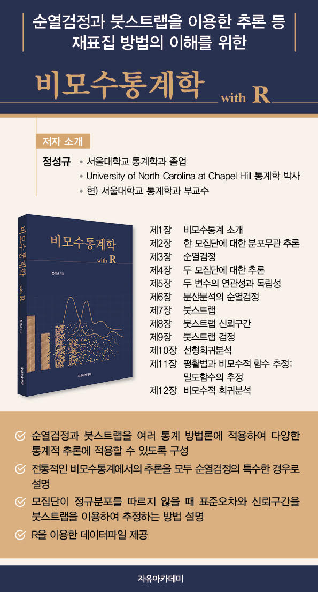

---
title: "Books"
--- 

<h4 id="dataliteracy">1. 정성규, **수학보다 데이터문해력**, EBS북스, 2022.</h4>

  -  Sungkyu Jung, *Data literacy over Mathematics*, EBS Books, 2022.
  - An easy-to-read popular science book, aiming at general population, ranging from high school students and college students to educators in the fields of statistics, data science and related areas. Written in Korean.
   - Paperback and eBook are on [sale](https://product.kyobobook.co.kr/detail/S000200243265).
   

 

<h4 id="npbook">2. 정성규, **비모수통계학 with R**, 자유아카데미, 2022. </h4>

  - Sungkyu Jung, *Nonparametric Statistics with R*, Free Academy, 2022.
  - This book, written in Korean, is aimed at advanced undergraduate and graduate students who are interested in nonparametric statistics. 
  - Instructors who choose to adopt this book will be provided with partial solutions to exercises (via the publisher).
   - Paperback and eBook are on [sale](https://product.kyobobook.co.kr/detail/S000001762578).
  - R codes are available at https://github.com/sungkyujung/npbook.
  - Selected as an excellent academic book by the National Academy of Sciences of the Republic of Korea in 2022. [[2022년 대한민국학술원 우수학술도서 선정](https://www.nas.go.kr/page/597aae5e-21c4-11ec-8e17-001e6746f4e8?ac=view&post=cb677d85-6ce9-475f-ba62-55ded25d7041&bbs_reg=&search_type=&search_text=&page=1)]
  - [Errata](./papers/npbook_errata.pdf)
    

