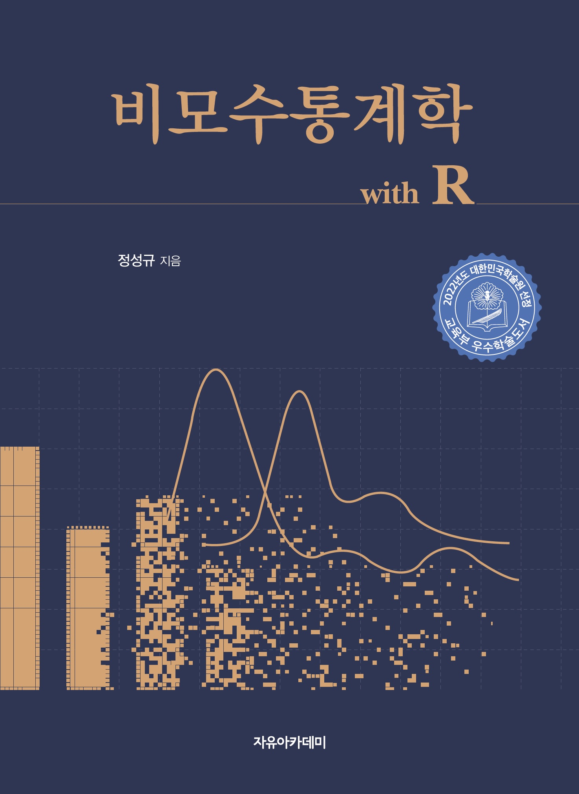

```{r setup, include=FALSE}
knitr::opts_chunk$set(echo = TRUE)
```


<!--html_preserve-->
<style type="text/css">
.main-container {
  max-width: 100%;
  margin-left: auto;
  margin-right: auto;
}
</style>

 

<div class="jumbotron">
    
    <div class="container">
      <!-- <h1 class="display-3">Sungkyu Jung</h1>--> 
      <p>Professor of Statistics</p>
      <p>Seoul National University</p>
      <p>Interested in statistical theory and methods for Non-Euclidean, High-Dimensional data analysis, and Data Privacy </p>
      <p><a class="btn btn-primary btn-lg" href="pubs.html" role="button">My publications</a>
      <a class="btn btn-primary btn-lg" href="TeachingPage.html" role="button">Courses</a>
      <a class="btn btn-primary btn-lg" href="https://statlet.github.io" role="button">Lab</a></p>
     
      
      
    </div>
    
    
    
    
</div>


<div class="container">
   <div class="row">
        <div class="col-md-8">
        	<h2>Brief Biography</h2>
          	<p> 
          	I am a Professor in the Department of <a href="https://stat.snu.ac.kr/en/">Statistics</a> and the director of <a href="https://statsri.snu.ac.kr/en/">Institute for Data Innovation in Science (IDIS)</a> at the <a href="http://en.snu.ac.kr/">Seoul National University</a>. Before I joined Seoul National University, I spent seven years at the University of Pittsburgh, after completing my PhD at the University of North Carolina at Chapel Hill. </p>
          	
          		<p>Research interest lies in the theoretical study and applications of modern Statistics and Data Science in the analysis of data that lie on non-standard spaces. This context includes the high-dimension, low-sample-size (HDLSS) situation, non-Euclidean data analysis, the interplay between geometry and statistics, and data fusion. In particular, models and methodologies for dimension reduction, visualization of important variation and hypothesis testings need to be developed with special care for these modern data situations. Particular applications include analysis of directions, landmark-based and skeletally-modeled object shapes, data in stratified spaces or from multiple sources, and retrieving low-dimensional geometric structures in high-dimensional data. I am also interested in statistical issues in Data Privacy, including Differential Privacy and Synthetic Data Generation. </p>
 
<p> I have authored two books (in Korean): 

<a href="books.html#dataliteracy">
  
</a>
<a href="books.html#npbook">
  
</a></p>

          	<!--	<p> <a href="http://science.snu.ac.kr/bbs/view.php?board_id=kor_profnews&idx=311&m=4&gul_no=6817&page=1">Interview article at College of Natural Science,Seoul National University (Oct. 10, 2018) in Korean</a></p>  -->
          		
          	<!--	<p> <a href="https://www.youtube.com/watch?v=WhlLZix8JPI">유튜브 홍보영상: 서울대 자연대 대학원에서 '연구뭐하지?' 통계학과 정성규 교수 연구실 Aug. 31, 2020) </a></p> -->
          	 
         


          		
     <!--   <p> - Last updated: `r tmp<-Sys.setlocale("LC_TIME", "C")` `r format(Sys.Date(), "%B %d, %Y")`</p>  	-->
			  </div>

        <div class="col-md-4">
   			</div>
		</div>
</div>
<!--/html_preserve-->

<!-- - Last updated: `r tmp<-Sys.setlocale("LC_TIME", "C")` `r format(Sys.Date(), "%B %d, %Y")`-->


<div class="container">
   <div class="row">
### Recent News [(More news)](news.html)

```{r, results='asis', echo=FALSE, comment=FALSE}
a = readLines("newslist.Rmd", n = -1)
n = length(a)
nullid = rep(1,n)
for(i in 1:n){if(identical("", a[i])){nullid[i] = 0}}
a = a[nullid == TRUE] 
n = length(a)
k = n
for(i in 1:n){if(identical("# BadNews", a[i])){k = i;break;}}
k = min(n,5)
for (i in 2:(k-1)) { 
  cat(paste(" - ", sep = "", a[i]))
  cat("\n\n")
}
```

- Last updated on `r tmp<-Sys.setlocale("LC_TIME", "C")` `r format(Sys.Date(), "%B %d, %Y")`        

</div>
</div>